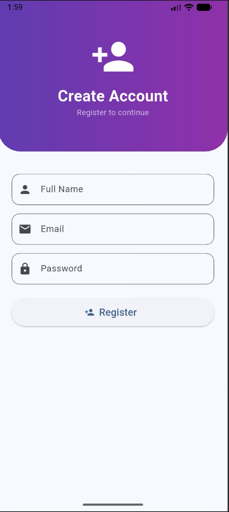
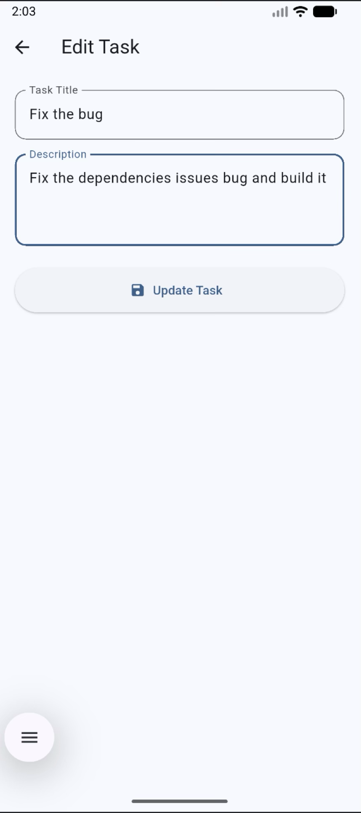
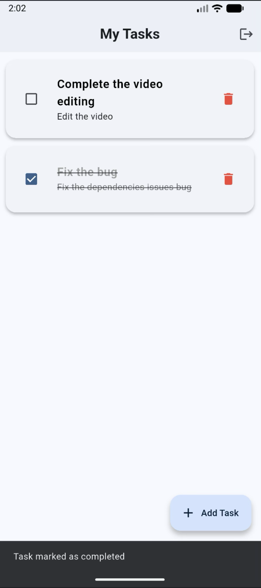
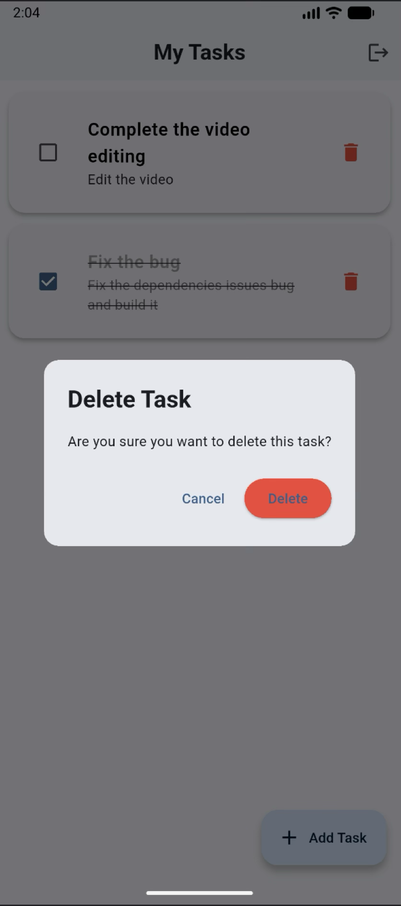
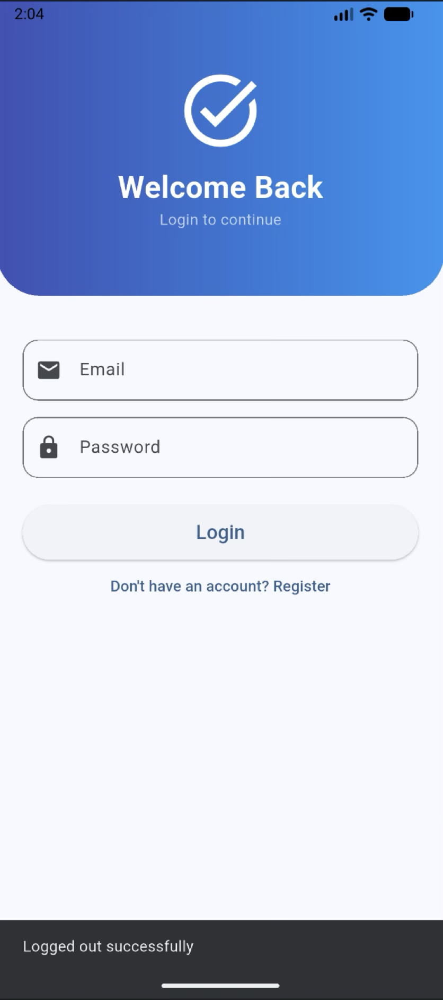

# 📱 Task Manager App  
### A Flutter CRUD Application using Back4App (BaaS)

This is a Task Manager mobile application built using **Flutter**, with **Back4App (Parse Server)** as the Backend-as-a-Service (BaaS).  
It allows users to register, log in, create tasks, update tasks, mark tasks as completed, delete tasks, and manage everything in real-time through Back4App’s cloud database.

---

## 🚀 Features

### 👤 User Authentication
- Register using student email ID  
- Login securely  
- Logout with session invalidation  

### 📝 Task Management (CRUD)
- Create tasks  
- Read / View task list  
- Update tasks  
- Delete tasks  
- Mark tasks as **Completed / Incomplete**  
- Auto-refresh UI after each change  

### ☁️ Backend-as-a-Service (BaaS)
- No need to write backend code  
- Back4App stores:
  - User credentials  
  - Task data  
  - Completion status  

---

## 🧰 Tech Stack

| Layer | Technology |
|-------|------------|
| Frontend | Flutter (Dart) |
| Backend | Back4App (Parse Server) |
| Database | Back4App Cloud DB |
| Version Control | GitHub |
| State Handling | Flutter setState() |
| UI | Material 3 |

---

## 📲 App Flow

1. **User Registration**
   - User signs up with name, email, and password.
   - Account is created on Back4App.

2. **User Login**
   - Authenticates with Parse Server.
   - Redirects to Home Screen.

3. **Home Screen**
   - Lists all tasks created by that user.
   - Allows adding, editing, deleting, refreshing tasks.
   - Checkbox to mark a task as completed.

4. **Logout**
   - User session is terminated.

---

## 🗄️ Database Schema (Back4App)

### **Class: Task**

| Field | Type | Description |
|-------|------|-------------|
| title | String | Task title |
| description | String | Task details |
| user | Pointer → `_User` | Owner of the task |
| isDone | Boolean | Completion status |

---

## 🛠️ Setup Instructions

### 1️⃣ Clone the Repository
```sh
git clone https://github.com/YOUR_USERNAME/task_manager_app.git
cd task_manager_app
```
### 2️⃣ Install Dependencies
```sh
flutter pub get
```
### 3️⃣ Configure Back4App

Inside back4app_config.dart, update:
```sh
class AppConstants {
  static const String appId = "your app id";
  static const String clientKey = "your client id";
  static const String serverUrl = "https://parseapi.back4app.com";
};
```
You can find these keys in:

Back4App Dashboard → App Settings → Security & Keys

### 4️⃣ Run the App
```sh
flutter run
```

### 📁 Project Folder Structure

```sh
lib/
│── main.dart
│── screens/
│     ├── login_screen.dart
│     ├── register_screen.dart
│     ├── home_screen.dart
│     └── task_form_screen.dart
└── utils/ back4app_config.dart
```

### 📸 Screenshots

#### Login Screen:


#### Register Screen:


#### Home Screen


#### Create Task Screen:


#### Edit Task Screen:


#### Marking Task as Completed


#### Delete Task Screen


#### Logout Successful Screen


### 🎥 Demo Video
Youtube link: 

### 🎯 Learning Outcomes

* Integrating Flutter apps with cloud backend services

* Using Back4App as a BaaS

* Implementing full CRUD operations

* Authentication using Parse Server

* Building clean, modern UI with Material 3

* Working with databases, pointers, and object relations